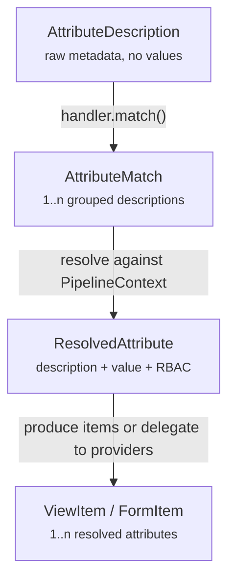

# Attribute Pipeline

## Purpose

The attribute pipeline transforms WildFly management model metadata into view and form items for the UI. It bridges the gap between raw attribute descriptions (metadata only from the management model) and interactive UI controls that display values and enable editing.

The pipeline solves the core problem of rendering heterogeneous WildFly attributes — simple scalars, complex nested objects, sibling groups, and composite structures — through a consistent, extensible architecture.

## Design

The pipeline uses a **two-tier architecture**: handlers claim and produce items for known patterns, while providers handle unclaimed attributes and child attributes delegated by handlers.

### Handlers

`AttributeHandler`s scan the attribute pool in priority order, claiming groups of related attributes into `AttributeMatch`es. Each handler both claims and produces items for its matches. Handlers bridge the **description world** (metadata only) and the **value world** (resolved snapshots with current values and RBAC state).

Registered handlers in priority order:

| Priority | Handler | Pattern | Attributes |
|---|---|---|---|
| 1 | `CredentialReferenceHandler` | OBJECT with `{store, alias, clear-text}` | 49 |
| 2 | `TimeUnitHandler` | OBJECT with `{time, unit}` | 8 |
| 3 | `FileHandler` | OBJECT with `{path, relative-to}` | 8 |
| 4 | `PathRelativeToHandler` | sibling path + relative-to STRING pairs | 31 |
| 5 | `MapHandler` | OBJECT with simple scalar VALUE_TYPE | 178 |
| 6 | `ListSimpleRecordHandler` | LIST of OBJECT with all simple/LIST-of-simple sub-attributes | 26 |
| 7 | `FlatteningHandler` | simpleRecord OBJECTs (all simple sub-attributes) | 111 |

### Providers

`ItemProvider`s handle unclaimed attributes and child attributes delegated by handlers. Providers operate in the value world only — they receive already-resolved `ResolvedAttribute`s. First match wins.

Registered providers in order:

| Priority | Provider | Pattern | Attributes |
|---|---|---|---|
| 1 | `RelativeToProvider` | standalone relative-to attributes (form only) | 1 |
| 2 | `DefaultProvider` | type-based dispatch catch-all | 5,384 |

### Type Flow

The pipeline operates through distinct type transformations:



`AttributeMatch` lives in the description world. `ResolvedAttribute` lives in the value world. Handlers bridge the two — they receive matches and context, perform resolution, and either produce items directly or delegate children to the provider chain via `Pipeline.viewItem/formItem`.

### Use Cases

The pipeline handles four distinct attribute patterns:

| Pattern | Match | Resolution | Items | Example |
|---|---|---|---|---|
| **Single attribute** | Unclaimed | 1 resolved | 1 item, 1 resolved | `enabled` (STRING) |
| **Composite OBJECT** | 1 OBJECT desc | 1 parent + n children | 1 composite item | `credential-reference` |
| **Flattened simple-record** | 1 OBJECT desc | 1 parent + n children | n items with FQN paths | `{foo, bar}` OBJECT |
| **Sibling group** | n descs | n resolved | 1 composite item | `path` + `relative-to` |
| **List of simple records** | 1 LIST desc | 1 parent, n entries × m children | 1 table item | `realms`, `global-modules` |

#### Single Attribute

A standalone STRING, BOOLEAN, INT, etc.

```
Match:    no handler claims it → unclaimed
Resolve:  Pipeline resolves → ResolvedAttribute(enabled)
Provider: DefaultProvider → SwitchControl / StringControl / etc.
Item:     1 item, 1 ResolvedAttribute
```

#### Composite OBJECT

An OBJECT kept as a single unit (e.g., `credential-reference`).

```
Match:    CredentialReferenceHandler claims it → AttributeMatch([credential-reference])
Handler:  resolves parent, derives children (store, alias, clear-text) via parent.child()
          delegates children to provider chain → DefaultProvider creates child items
          wraps in composite CredentialReferenceViewItem / CredentialReferenceControl
Item:     1 composite item
```

#### Flattened Simple-Record OBJECT

An OBJECT with all simple sub-attributes, flattened into individual items.

```
Match:    FlatteningHandler claims it → AttributeMatch([my-record])
Handler:  resolves parent (RBAC captured), derives children:
          → parent.child("foo") → ResolvedAttribute(foo) with fqn="my-record.foo"
          → parent.child("bar") → ResolvedAttribute(bar) with fqn="my-record.bar"
          Each child inherits the parent's readable/writable state.
          Delegates each child to Pipeline.viewItem/formItem → provider chain.
Items:    n items, each holds 1 ResolvedAttribute with FQN path
```

#### Sibling Group

Multiple sibling attributes that semantically belong together (e.g., `path` + `relative-to`).

```
Match:    PathRelativeToHandler claims both → AttributeMatch([path, relative-to])
Handler:  resolves both attributes against context
          creates composite PathRelativeToViewItem / PathRelativeToFormItem
Item:     1 composite item, holds 2 ResolvedAttributes
```

#### List of Simple Records

A LIST where each entry is an OBJECT with all simple sub-attributes.

```
Match:    ListSimpleRecordHandler claims it → AttributeMatch([realms])
Handler:  resolves parent, iterates list entries via listEntry()
          for each entry, delegates children to provider chain via child().detachFromParent()
          renders as compact table (view) or editable table with modal form (edit)
Item:     1 table item, n entries × m children
```

## Current State & Open Work

### Coverage (WildFly 40)

Total attributes by storage and type (from model graph analysis):

| Storage | STRING | BOOLEAN | INT | LONG | DOUBLE | OBJECT | LIST | BYTES | Total |
|---|---|---|---|---|---|---|---|---|---|
| Configuration | 1,628 | 1,062 | 613 | 285 | 19 | 303 | 207 | 1 | 4,118 |
| Runtime | 500 | 318 | 333 | 353 | 17 | 64 | 100 | — | 1,685 |

Configuration OBJECT breakdown (303 total):

| Category | Count | Handler |
|---|---|---|
| Simple scalar value-type (maps) | 178 | `MapHandler` |
| Simple record (all simple sub-attrs) | 111 | `FlatteningHandler` |
| Complex (nested LIST/OBJECT children) | 14 | Not yet covered |

Configuration LIST breakdown (207 total):

| Category | Count | Handler |
|---|---|---|
| LIST of simple type (STRING, INT, etc.) | 173 | `DefaultProvider` |
| LIST of simple records (incl. `LIST<simple>` sub-attrs) | 26 | `ListSimpleRecordHandler` |
| LIST with nested `LIST<OBJECT>` | 5 | Not yet covered |
| LIST with nested OBJECT | 3 | Not yet covered |

The pipeline covers **~99%** of simple/scalar attributes and **~95%** of all configuration attributes. The remaining ~22 uncovered configuration attribute definitions fall into three categories below.

Runtime attributes are read-only, so even uncovered attributes render acceptably as plain text or JSON display.

### Planned Handlers

The following handlers are planned but not yet implemented:

| Handler | Pattern | Count | Priority | Examples |
|---|---|---|---|---|
| **List of Nested Complex Lists** | LIST of OBJECT with nested `LIST<OBJECT>` sub-attributes | 5 | MEDIUM | `mechanism-configurations`, `permission-mappings`, `constant-headers`, `services` |
| **List of Nested Objects** | LIST of OBJECT with nested OBJECT sub-attributes | 3 | MEDIUM | `server-auth-modules`, `principal-query`, `content` |
| **Complex Object** | Complex/recursive OBJECTs with nested LIST/OBJECT children | 14 | LOW | `filter` (logging, 8 resources), `identity-mapping`, `jwt`, `any`/`not` (interface), `attributes` (console-access-log) |

The `ListSimpleRecordHandler` now covers LIST attributes with all-simple sub-attributes including `LIST<simple>` sub-attributes (e.g., `role-map` with its `to: LIST<STRING>`), pushing coverage past 95%.

## Implementation Details

The pipeline source code is in `ui/src/main/java/org/jboss/hal/ui/resource/pipeline/`, with comprehensive package-level Javadoc describing the architecture and data flow. Each handler documents:

- Pattern recognition logic
- Attribute claiming rules
- Resolution strategy
- Item production approach
- Covered attributes with examples
