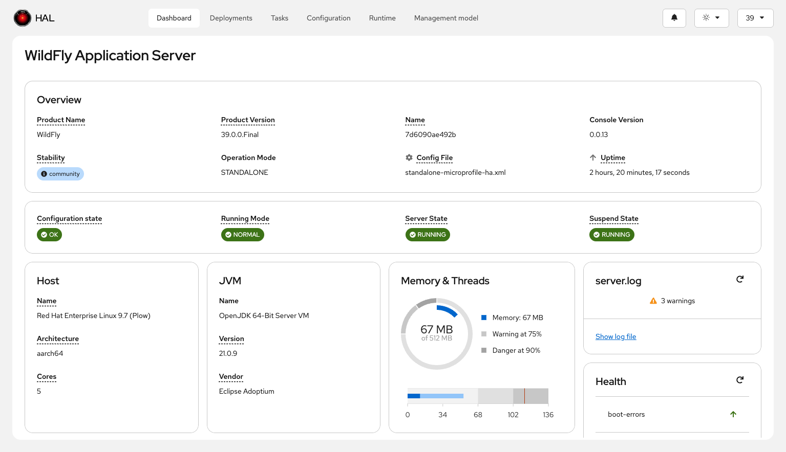
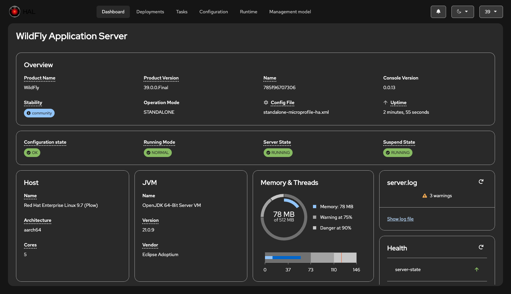

# Dashboard

The dashboard provides an at-a-glance overview of key information about your WildFly server or domain. It uses a card-based layout to present essential metrics and status information in an organized, easy-to-scan format.

## Universal Cards

These cards appear in both standalone server and domain mode:

- **General Information**: Server or domain identity, version, and configuration details
- **Deployments**: Status and overview of deployed applications
- **Log File**: Quick access to log file viewing and searching
- **Host**: Host system information
- **JVM**: Java Virtual Machine details and configuration
- **Runtime**: WildFly runtime information
- **Memory**: Heap and non-heap memory usage
- **Threads**: Thread pool status and metrics
- **Help Links**: Quick access to documentation and community resources

## Domain-Specific Cards

When connected to a domain controller, additional cards provide domain-wide visibility:

- **Hosts**: Overview of all managed hosts in the domain
- **Servers**: Status of all server instances across hosts
- **Profiles**: Available server profiles
- **Server Groups**: Server group configuration and membership

The dashboard adapts to the selected theme and contrast settings, ensuring readability in any visual mode:

