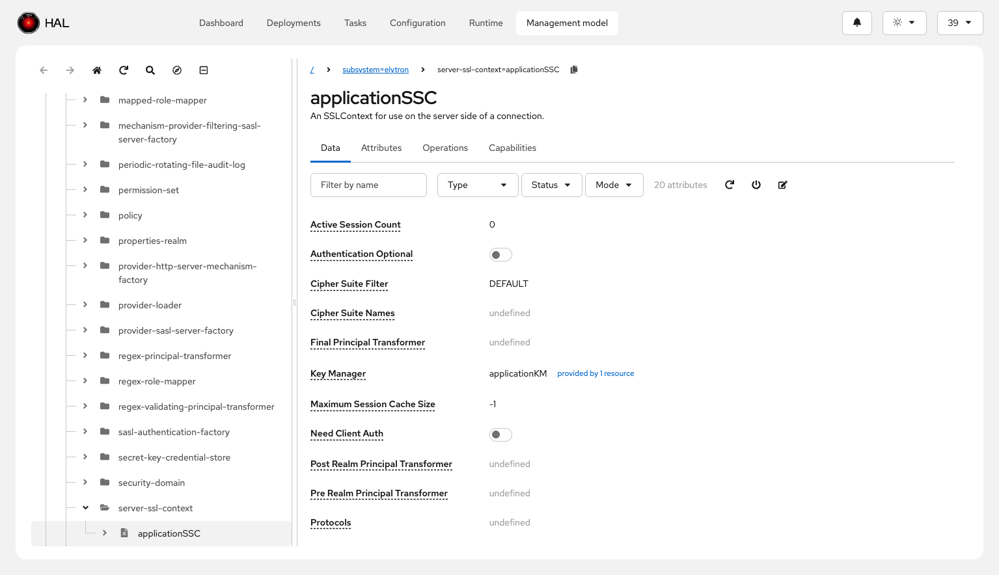
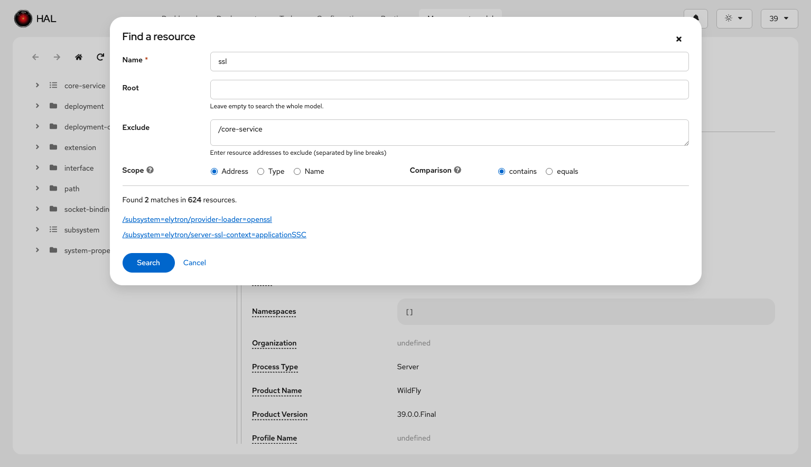
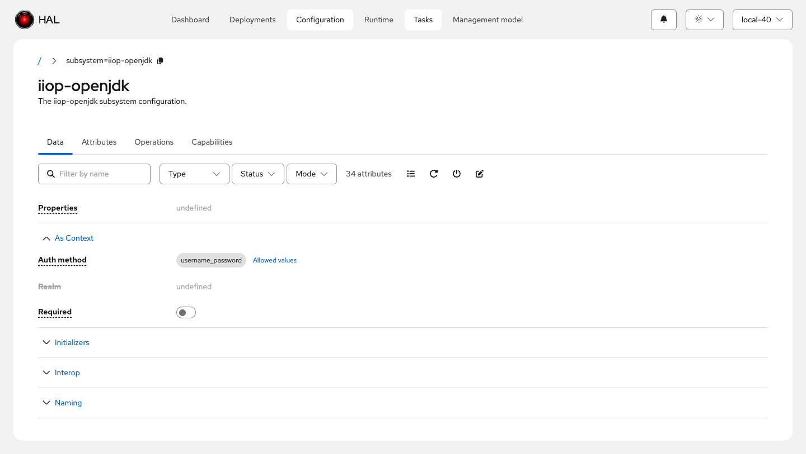
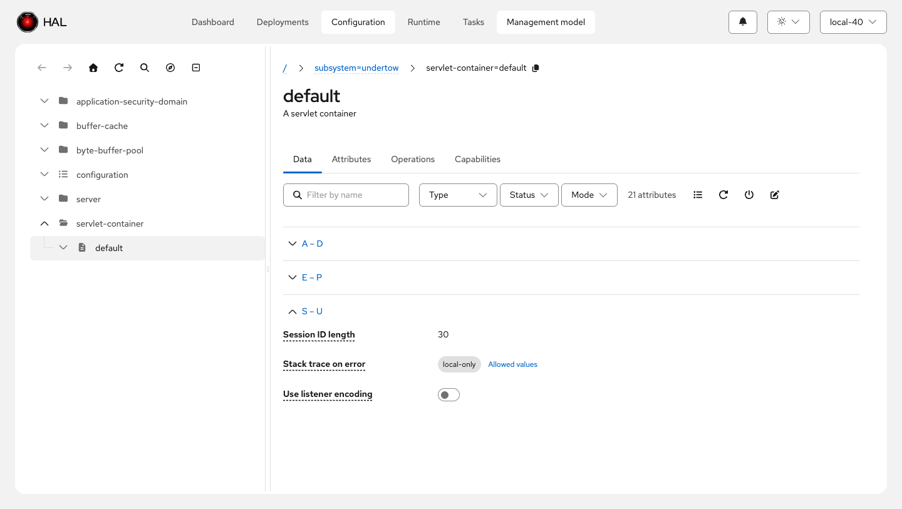

# Model Browser

The model browser is the primary tool for exploring and working with WildFly's management model. It provides a comprehensive view of resources, their attributes, operations, and relationships.

## Navigation and Search

The model browser features a **resizable tree view** for browsing the resource hierarchy. A **history mechanism** tracks your navigation path with backward and forward buttons, making it easy to retrace your steps.

**Search capabilities** let you find resources by address, type, or name. The **go-to address** feature allows jumping directly to any resource by entering its management model address. **Clickable breadcrumbs** show your current location in the hierarchy and provide quick navigation to parent resources. You can **copy the current address to the clipboard** for use in CLI commands or scripts.

## Resource Lists and References

Resource list views display **descriptions** directly in the table, giving you context without needing to navigate into each resource. When an attribute references a capability, you can **follow capability references** to navigate to the related resource.

The model browser supports **scoped browsing**: when you navigate to a resource from elsewhere in the console (such as from a finder), the browser adapts to that resource's scope. Flat resources without children display the detail panel at full width, and breadcrumbs and find/goto functions are scoped to the root resource.

## Creating Dependent Resources

When configuring a resource that references another resource, the model browser makes it easy to create those dependencies on the fly, streamlining the configuration workflow:

<video controls width="100%">
  <source src="./add-resources-on-the-fly.mp4" type="video/mp4">
  Your browser does not support the video tag.
</video>

## Data Tab

The Data tab displays the current values of a resource's attributes with powerful filtering and organization:

**Filtering** options let you narrow down attributes by name, status (defined/undefined, required/not required, deprecated/not deprecated), and mode (storage vs. access type).

**Attribute groups** organize attributes based on metadata defined in the resource description, making it easier to find related configuration options:

For resources with many attributes, **auto-grouping** kicks in when 20 or more attributes are present and no metadata-defined groups exist. Attributes are automatically organized into alphabetical letter-range sections (such as "A – D", "E – H") for easier navigation:

**Attribute descriptions** appear as popovers when you hover over an attribute name, providing context without cluttering the interface. Attributes that reference capabilities show **links to the referenced resources**, with support for multiple references displayed in a popup.

The Data tab supports both **simple nested attributes** and **complex nested attributes** in a read-only view, allowing you to inspect deeply structured configuration. **Allowed values** are displayed for attributes with constrained value sets, and **expression syntax** is highlighted for attributes that use WildFly expressions.

## Attributes Tab

The Attributes tab provides a metadata-focused view of all attributes defined for the resource:

**Filtering** by name, type, status (required/not required, deprecated/not deprecated), and mode (storage/access type) helps you locate specific attributes. Full support for **nested attributes** allows exploration of complex attribute structures.

## Operations Tab

The Operations tab lists all management operations available for the selected resource:

**Filtering** by name, signature (parameters/no parameters, return value/no return value), and deprecation status makes it easy to find the operation you need. A toggle to **omit or show global operations** (remembered as a user setting) reduces clutter by hiding operations inherited from all resources. You can **execute operations** directly from the browser with a form-based interface for providing parameters.

## Capabilities Tab

The Capabilities tab displays all capabilities provided or required by the selected resource, giving insight into the resource's role in the management model and its relationships with other resources.
