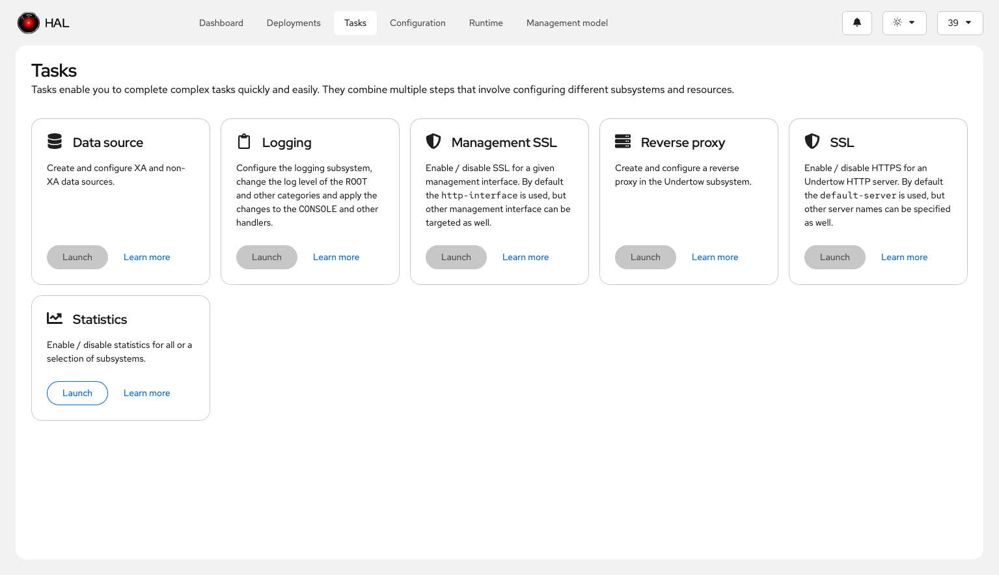

# Tasks

Tasks provide a use-case-centric approach to completing complex management operations. Unlike the resource-centric views in the model browser, tasks focus on specific administrative workflows that often span multiple subsystems and resources.

## Concept

Many administrative operations require configuring attributes across different subsystems or resources. For example, enabling statistics might involve touching logging, datasources, messaging, and other subsystems. Tasks bring these scattered configuration points together into a single workflow, making it faster to complete common administrative actions.

## How Tasks Work

Tasks are defined using the `Task` interface, which specifies metadata and behavior:

- **id()**: Unique identifier for the task
- **title()**: Human-readable task name
- **icon()**: Visual icon displayed in the task list
- **summary()**: Brief description of what the task does
- **elements()**: The resources and attributes the task operates on
- **run()**: Logic for executing the task
- **enabled()**: Whether the task is currently available

Tasks are implemented as `@Dependent` CDI beans and discovered at build time, making them extensible by third-party subsystems or custom modules.

## Example: Statistics-Enabled Task

The **statistics-enabled task** demonstrates the power of the task model. Many WildFly resources define a `statistics-enabled` attribute to control whether runtime statistics are collected for that resource. Manually finding and configuring all these attributes across datasources, messaging queues, web subsystems, and other components would be time-consuming and error-prone.

The statistics-enabled task consolidates all resources that define this attribute into a single view. You can:

- See which resources currently have statistics enabled or disabled
- Filter the list to find specific resource types
- Bulk-modify the `statistics-enabled` attribute across selected resources
- Assign existing expressions or create new expressions (if supported by the resource)

<video controls width="100%">
  <source src="../media/statistics-task.mp4" type="video/mp4">
  Your browser does not support the video tag.
</video>

This single task replaces what would otherwise require navigating through dozens of resource pages and manually toggling attributes.

## Extensibility

Because tasks are CDI beans discovered at build time, subsystems can contribute their own tasks tailored to domain-specific workflows. This makes the task mechanism a powerful extension point for specialized management scenarios.
