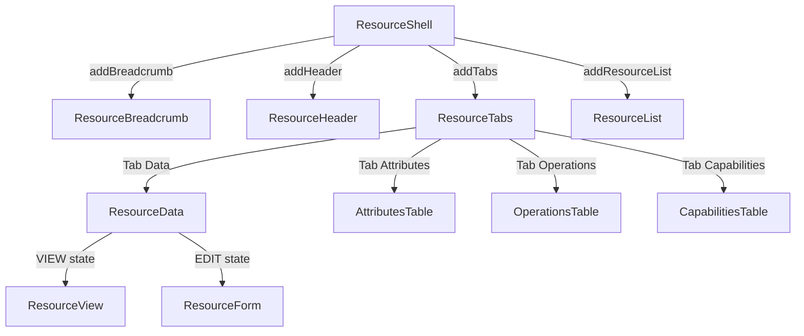

# Resource Component Architecture

## Overview

The HAL console provides composable UI components for viewing and interacting with WildFly management resources. These
components live in `org.jboss.hal.ui.resource` and can be used independently or composed together via `ResourceShell`.

## Component Hierarchy



## Layering

The components follow a clear layering from layout to presentation:

```
ResourceShell (layout — composable container)
  ├─ ResourceBreadcrumb (navigation — clickable address segments)
  ├─ ResourceHeader (presentation — name + stability + description)
  ├─ ResourceTabs (composition — which perspectives to show)
  │    ├─ Tab "Data" → ResourceData (behavior — view/edit state machine)
  │    │    ├─ ResourceView (presentation — read-only)
  │    │    └─ ResourceForm (presentation — editable)
  │    ├─ Tab "Attributes" → AttributesTable (presentation — metadata table)
  │    ├─ Tab "Operations" → OperationsTable (presentation — operations + execute)
  │    └─ Tab "Capabilities" → CapabilitiesTable (presentation — capabilities list)
  └─ ResourceList (alternative to tabs, for folder nodes)
```

## Package Structure

```
ui/resource/
  ├─ ResourceBreadcrumb.java       — clickable address breadcrumb
  ├─ ResourceHeader.java           — name + stability + description
  ├─ ResourceList.java             — filterable child resource list
  ├─ ResourceShell.java            — composable layout shell
  ├─ ResourceTabs.java             — tab container (Data/Attributes/Operations/Capabilities)
  ├─ data/                         — view/edit state machine
  │    ├─ ResourceData.java        — VIEW↔EDIT lifecycle for attribute values
  │    ├─ ResourceDataToolbar.java — context-aware toolbar for view/edit modes
  │    └─ ResourceFilter.java      — multi-criteria attribute filter
  ├─ view/                         — read-only presentation
  │    ├─ ResourceView.java        — attribute values as description list
  │    └─ ViewItem*.java           — individual attribute display
  ├─ form/                         — editable presentation
  │    ├─ ResourceForm.java        — attribute form with validation
  │    └─ FormItem*.java           — individual attribute editors
  └─ dialog/                       — modal dialogs
       ├─ ResourceDialogs.java     — add/delete/execute operation modals
       └─ ExecuteOperationDialog.java
```

## Composition Examples

### Full resource view

```java
metadataRepository.lookup(template, metadata -> {
    resourceShell(template, metadata)
        .addBreadcrumb(resourceBreadcrumb(template, metadata)
            .onSegmentClick(t -> navigate(t)))
        .addHeader(resourceHeader(template, metadata))
        .addTabs(resourceTabs(template, metadata));
});
```

### Folder view with child resources

```java
metadataRepository.lookup(template, metadata -> {
    resourceShell(template, metadata)
        .addBreadcrumb(resourceBreadcrumb(template, metadata)
            .onSegmentClick(t -> navigate(t)))
        .addHeader(resourceHeader(template, metadata))
        .addResourceList(resourceList(template, metadata)
            .onSelect(t -> navigate(t))
            .onAdd((parent, child, singleton) -> addResource(parent, child, singleton))
            .onDelete(t -> deleteResource(t)));
});
```

### Minimal — tabs only

```java
metadataRepository.lookup(template, metadata -> {
    resourceShell(template, metadata)
        .addTabs(resourceTabs(template, metadata));
});
```

## Data Loading

| Component | Construction | Attach |
|---|---|---|
| ResourceShell | Layout only | — |
| ResourceBreadcrumb | Renders from template | — |
| ResourceHeader | Renders from metadata | — |
| ResourceTabs | Creates tab structure | — |
| ResourceData | Builds DOM skeleton | `READ_RESOURCE` → populates view/form |
| ResourceList | Builds toolbar + container | `READ_CHILDREN_TYPES` → populates data list |

## Communication

Components use **callbacks** instead of DOM events:

| Component | Callbacks |
|---|---|
| ResourceBreadcrumb | `onSegmentClick(Consumer<AddressTemplate>)` |
| ResourceList | `onSelect(Consumer<AddressTemplate>)`, `onAdd(AddCallback)`, `onDelete(Consumer<AddressTemplate>)` |

## Model Browser Relationship

The model browser (`org.jboss.hal.ui.modelbrowser`) currently has its own implementation of these concerns. A future
migration will refactor the model browser to consume these composable components, eliminating the duplication. Until
then, both implementations coexist.
