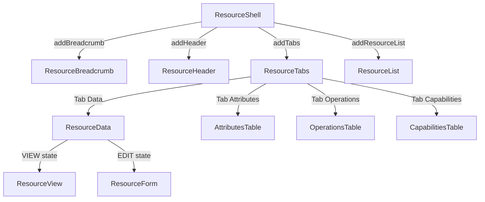

# Composable Resource Components Implementation Plan

> **For agentic workers:** REQUIRED SUB-SKILL: Use superpowers:subagent-driven-development (recommended) or superpowers:executing-plans to implement this plan task-by-task. Steps use checkbox (`- [ ]`) syntax for tracking.

**Goal:** Build composable, reusable UI components in `org.jboss.hal.ui.resource` for viewing and interacting with WildFly management resources, independent of the model browser.

**Architecture:** New components (ResourceShell, ResourceBreadcrumb, ResourceHeader, ResourceTabs, ResourceList) are built in `ui.resource` alongside the existing code. They accept `(AddressTemplate, Metadata)` at construction, load runtime data on attach via the Elemento `Attachable` pattern, and communicate via callbacks. The existing `manager/` subpackage is renamed to `data/` with `ResourceManager` → `ResourceData` and `ResourceToolbar` → `ResourceDataToolbar`. The model browser in `ui.modelbrowser` is not modified — it will migrate to use these components in a follow-up.

**Tech Stack:** Java 21, J2CL, Elemento, PatternFly Java, Crysknife CDI

## Global Constraints

- All new classes use Apache 2.0 license header (copy from any existing file)
- Factory methods follow HAL pattern: `static ComponentName componentName(args)` in a `// ------------------------------------------------------ factory` section
- Section comments use the HAL format: `// ------------------------------------------------------ <name>`
- Components implement `IsElement<HTMLElement>` and optionally `Attachable`, `TypedBuilder`, `OuiaSupport`
- Services accessed via static `uic()` method: `uic().dispatcher()`, `uic().metadataRepository()`, etc.
- CSS classes via `halComponent(...)` from `HalClasses`
- OUIA IDs via `OuiaIds` constants
- No modifications to `ui.modelbrowser` package (except making three table classes public in Task 2)
- Code style: 4-space indent, UTF-8, max 128 chars, LF line endings

---

### Task 1: Rename `manager/` to `data/` package

Rename the existing `ui.resource.manager` package to `ui.resource.data` and rename `ResourceManager` → `ResourceData`, `ResourceToolbar` → `ResourceDataToolbar`. This establishes the new package structure before adding new components.

**Files:**
- Rename: `ui/src/main/java/org/jboss/hal/ui/resource/manager/` → `ui/src/main/java/org/jboss/hal/ui/resource/data/`
- Rename: `ResourceManager.java` → `ResourceData.java` (class + factory method)
- Rename: `ResourceToolbar.java` → `ResourceDataToolbar.java` (class + factory method)
- Modify: `ui/src/main/java/org/jboss/hal/ui/resource/data/package-info.java` (update references)
- Modify: `ui/src/main/java/org/jboss/hal/ui/resource/package-info.java` (update references)
- Modify: all files that import from `ui.resource.manager` (use IDE refactoring)

**Interfaces:**
- Consumes: nothing (first task)
- Produces: `ResourceData.resourceData(AddressTemplate, Metadata)` factory method, `ResourceDataToolbar.resourceDataToolbar(ResourceData, Filter, ObservableValue, ObservableValue)` factory method — both in `org.jboss.hal.ui.resource.data`

- [ ] **Step 1: Use IntelliJ refactoring to rename the package**

Use IntelliJ's rename refactoring (via JetBrains MCP) to rename `org.jboss.hal.ui.resource.manager` → `org.jboss.hal.ui.resource.data`. This updates all imports across the codebase automatically.

- [ ] **Step 2: Rename ResourceManager → ResourceData**

Use IntelliJ's rename refactoring to rename the class `ResourceManager` to `ResourceData`. This updates the class name, constructor, factory method name (`resourceManager` → `resourceData`), all references, and the file name.

- [ ] **Step 3: Rename ResourceToolbar → ResourceDataToolbar**

Use IntelliJ's rename refactoring to rename the class `ResourceToolbar` to `ResourceDataToolbar`. This updates `resourceToolbar` → `resourceDataToolbar` factory method and all references.

- [ ] **Step 4: Update package-info.java for data package**

Update `ui/src/main/java/org/jboss/hal/ui/resource/data/package-info.java`:

```java
/*
 *  Copyright 2024 Red Hat
 *
 *  Licensed under the Apache License, Version 2.0 (the "License");
 *  you may not use this file except in compliance with the License.
 *  You may obtain a copy of the License at
 *
 *      https://www.apache.org/licenses/LICENSE-2.0
 *
 *  Unless required by applicable law or agreed to in writing, software
 *  distributed under the License is distributed on an "AS IS" BASIS,
 *  WITHOUT WARRANTIES OR CONDITIONS OF ANY KIND, either express or implied.
 *  See the License for the specific language governing permissions and
 *  limitations under the License.
 */

/**
 * View/edit state machine for WildFly management resource attribute values.
 * <p>
 * This package contains the central state machine that coordinates viewing and editing of resource attributes. It manages
 * transitions between view, edit, and error states, orchestrates resource loading via the {@code Dispatcher}, and combines
 * toolbar actions with attribute filtering.
 * <p>
 * Key components:
 * <dl>
 * <dt>{@link org.jboss.hal.ui.resource.data.ResourceData}</dt>
 * <dd>State machine orchestrating the view/edit/error lifecycle for resource attributes. Loads resource data on attach and
 * switches between {@link org.jboss.hal.ui.resource.view.ResourceView} (read-only) and
 * {@link org.jboss.hal.ui.resource.form.ResourceForm} (editable).</dd>
 * <dt>{@link org.jboss.hal.ui.resource.data.ResourceDataToolbar}</dt>
 * <dd>Action toolbar with attribute filters and context-aware buttons for view and edit modes.</dd>
 * <dt>{@link org.jboss.hal.ui.resource.data.ResourceFilter}</dt>
 * <dd>Multi-criteria attribute filter supporting name search, type, status, storage, and access type.</dd>
 * </dl>
 */
package org.jboss.hal.ui.resource.data;
```

- [ ] **Step 5: Update parent package-info.java**

Update `ui/src/main/java/org/jboss/hal/ui/resource/package-info.java` — replace `{@link org.jboss.hal.ui.resource.manager}` with `{@link org.jboss.hal.ui.resource.data}` and update the description from "Resource management orchestration with toolbar and filtering." to "View/edit state machine for resource attribute values.".

- [ ] **Step 6: Verify the build compiles**

Run: `mvn compile -P op`
Expected: BUILD SUCCESS with no compilation errors

- [ ] **Step 7: Commit**

```bash
git add -A
git commit -m "refactor: rename resource manager package to data

Rename ui.resource.manager → ui.resource.data to better reflect the
package's responsibility as the view/edit state machine for resource
attribute values. Rename ResourceManager → ResourceData and
ResourceToolbar → ResourceDataToolbar."
```

---

### Task 2: Make table classes public

The `AttributesTable`, `OperationsTable`, and `CapabilitiesTable` in `ui.modelbrowser` are package-private. The new `ResourceTabs` component in `ui.resource` needs to instantiate them. Make them public.

**Files:**
- Modify: `ui/src/main/java/org/jboss/hal/ui/modelbrowser/AttributesTable.java` (change visibility)
- Modify: `ui/src/main/java/org/jboss/hal/ui/modelbrowser/OperationsTable.java` (change visibility)
- Modify: `ui/src/main/java/org/jboss/hal/ui/modelbrowser/CapabilitiesTable.java` (change visibility)

**Interfaces:**
- Consumes: nothing
- Produces: `new AttributesTable(Metadata)`, `new OperationsTable(AddressTemplate, Metadata)`, `new CapabilitiesTable(Metadata)` — now accessible from outside `ui.modelbrowser`

- [ ] **Step 1: Make AttributesTable public**

In `ui/src/main/java/org/jboss/hal/ui/modelbrowser/AttributesTable.java`, change:

```java
class AttributesTable implements IsElement<HTMLElement> {
```

to:

```java
public class AttributesTable implements IsElement<HTMLElement> {
```

Also make the constructor public:

```java
AttributesTable(Metadata metadata) {
```

to:

```java
public AttributesTable(Metadata metadata) {
```

- [ ] **Step 2: Make OperationsTable public**

In `ui/src/main/java/org/jboss/hal/ui/modelbrowser/OperationsTable.java`, change the class and constructor to `public`.

- [ ] **Step 3: Make CapabilitiesTable public**

In `ui/src/main/java/org/jboss/hal/ui/modelbrowser/CapabilitiesTable.java`, change the class and constructor to `public`.

- [ ] **Step 4: Verify the build compiles**

Run: `mvn compile -P op`
Expected: BUILD SUCCESS

- [ ] **Step 5: Commit**

```bash
git add ui/src/main/java/org/jboss/hal/ui/modelbrowser/AttributesTable.java \
       ui/src/main/java/org/jboss/hal/ui/modelbrowser/OperationsTable.java \
       ui/src/main/java/org/jboss/hal/ui/modelbrowser/CapabilitiesTable.java
git commit -m "refactor: make table classes public for reuse

Make AttributesTable, OperationsTable, and CapabilitiesTable public so
they can be consumed by the new composable resource components in
ui.resource."
```

---

### Task 3: Create ResourceHeader

A component that displays a resource's name, stability label (if applicable), and description paragraph. Renders fully from metadata at construction time — no attach-time data loading.

**Files:**
- Create: `ui/src/main/java/org/jboss/hal/ui/resource/ResourceHeader.java`

**Interfaces:**
- Consumes: `AddressTemplate`, `Metadata`, `StabilityLabel.stabilityLabel(Stability)`, `uic().environment().highlightStability(Stability)`
- Produces: `ResourceHeader.resourceHeader(AddressTemplate, Metadata)` returning `IsElement<HTMLElement>`

- [ ] **Step 1: Create ResourceHeader.java**

Create `ui/src/main/java/org/jboss/hal/ui/resource/ResourceHeader.java`:

```java
/*
 *  Copyright 2024 Red Hat
 *
 *  Licensed under the Apache License, Version 2.0 (the "License");
 *  you may not use this file except in compliance with the License.
 *  You may obtain a copy of the License at
 *
 *      https://www.apache.org/licenses/LICENSE-2.0
 *
 *  Unless required by applicable law or agreed to in writing, software
 *  distributed under the License is distributed on an "AS IS" BASIS,
 *  WITHOUT WARRANTIES OR CONDITIONS OF ANY KIND, either express or implied.
 *  See the License for the specific language governing permissions and
 *  limitations under the License.
 */
package org.jboss.hal.ui.resource;

import org.jboss.elemento.IsElement;
import org.jboss.hal.env.Stability;
import org.jboss.hal.meta.AddressTemplate;
import org.jboss.hal.meta.Metadata;

import elemental2.dom.HTMLElement;

import static org.jboss.elemento.Elements.div;
import static org.jboss.elemento.Elements.p;
import static org.jboss.hal.resources.HalClasses.halComponent;
import static org.jboss.hal.resources.HalClasses.resource;
import static org.jboss.hal.ui.StabilityLabel.stabilityLabel;
import static org.jboss.hal.ui.UIContext.uic;
import static org.patternfly.component.content.Content.content;
import static org.patternfly.component.title.Title.title;
import static org.patternfly.layout.flex.AlignItems.center;
import static org.patternfly.layout.flex.Flex.flex;
import static org.patternfly.layout.flex.FlexItem.flexItem;
import static org.patternfly.style.Size._3xl;

/**
 * Displays the name, stability label, and description of a WildFly management resource.
 * <p>
 * Renders fully from metadata at construction time — no attach-time data loading. The stability label is only shown when the
 * resource's stability level requires highlighting (as determined by the current environment settings).
 */
public class ResourceHeader implements IsElement<HTMLElement> {

    // ------------------------------------------------------ factory

    /** Creates a new resource header for the given template and metadata. */
    public static ResourceHeader resourceHeader(AddressTemplate template, Metadata metadata) {
        return new ResourceHeader(template, metadata);
    }

    // ------------------------------------------------------ instance

    private final HTMLElement root;

    ResourceHeader(AddressTemplate template, Metadata metadata) {
        String name = template.isEmpty() ? "Management Model" : template.last().value;
        String description = metadata.resourceDescription().description();
        Stability stability = metadata.resourceDescription().stability();

        this.root = content()
                .add(flex().alignItems(center)
                        .addItem(flexItem().add(title(1, _3xl, name)))
                        .run(f -> {
                            if (uic().environment().highlightStability(stability)) {
                                f.addItem(flexItem().add(stabilityLabel(stability)));
                            }
                        }))
                .run(c -> {
                    if (description != null && !description.isEmpty()) {
                        c.add(p().text(description));
                    }
                })
                .element();
    }

    @Override
    public HTMLElement element() {
        return root;
    }
}
```

- [ ] **Step 2: Verify the build compiles**

Run: `mvn compile -P op`
Expected: BUILD SUCCESS

- [ ] **Step 3: Commit**

```bash
git add ui/src/main/java/org/jboss/hal/ui/resource/ResourceHeader.java
git commit -m "feat: add ResourceHeader component

Composable component that displays a resource's name, stability label,
and description. Renders from metadata at construction time."
```

---

### Task 4: Create ResourceBreadcrumb

A component that renders clickable breadcrumb segments for a resource address. Each segment is a clickable link that invokes a callback. The active (last) segment includes a copy-to-clipboard button.

**Files:**
- Create: `ui/src/main/java/org/jboss/hal/ui/resource/ResourceBreadcrumb.java`

**Interfaces:**
- Consumes: `AddressTemplate`, `Metadata`
- Produces: `ResourceBreadcrumb.resourceBreadcrumb(AddressTemplate, Metadata)` with `.onSegmentClick(Consumer<AddressTemplate>)` callback

- [ ] **Step 1: Create ResourceBreadcrumb.java**

Create `ui/src/main/java/org/jboss/hal/ui/resource/ResourceBreadcrumb.java`:

```java
/*
 *  Copyright 2024 Red Hat
 *
 *  Licensed under the Apache License, Version 2.0 (the "License");
 *  you may not use this file except in compliance with the License.
 *  You may obtain a copy of the License at
 *
 *      https://www.apache.org/licenses/LICENSE-2.0
 *
 *  Unless required by applicable law or agreed to in writing, software
 *  distributed under the License is distributed on an "AS IS" BASIS,
 *  WITHOUT WARRANTIES OR CONDITIONS OF ANY KIND, either express or implied.
 *  See the License for the specific language governing permissions and
 *  limitations under the License.
 */
package org.jboss.hal.ui.resource;

import java.util.function.Consumer;

import org.jboss.elemento.By;
import org.jboss.elemento.Id;
import org.jboss.elemento.IsElement;
import org.jboss.hal.meta.AddressTemplate;
import org.jboss.hal.meta.Metadata;
import org.jboss.hal.meta.Segment;
import org.patternfly.component.breadcrumb.Breadcrumb;
import org.patternfly.component.breadcrumb.BreadcrumbItem;
import org.patternfly.component.icon.Icon;
import org.patternfly.component.icon.IconSize;
import org.patternfly.component.tooltip.Tooltip;

import elemental2.dom.HTMLElement;

import static elemental2.dom.DomGlobal.navigator;
import static org.jboss.elemento.Elements.span;
import static org.jboss.elemento.EventType.click;
import static org.patternfly.component.breadcrumb.Breadcrumb.breadcrumb;
import static org.patternfly.component.breadcrumb.BreadcrumbItem.breadcrumbItem;
import static org.patternfly.component.icon.Icon.icon;
import static org.patternfly.component.tooltip.Tooltip.tooltip;
import static org.patternfly.icon.IconSets.fas.copy;

/**
 * Clickable breadcrumb trail for a WildFly management resource address.
 * <p>
 * Each address segment is rendered as a breadcrumb item. Clicking a segment invokes the {@code onSegmentClick} callback with
 * the corresponding address template. The active (last) segment includes a copy-to-clipboard button for the full address.
 * <p>
 * Renders fully from the address template at construction time — no attach-time data loading.
 */
public class ResourceBreadcrumb implements IsElement<HTMLElement> {

    // ------------------------------------------------------ factory

    /** Creates a new breadcrumb for the given resource address. */
    public static ResourceBreadcrumb resourceBreadcrumb(AddressTemplate template, Metadata metadata) {
        return new ResourceBreadcrumb(template, metadata);
    }

    // ------------------------------------------------------ instance

    private final HTMLElement root;
    private Consumer<AddressTemplate> onSegmentClick;

    ResourceBreadcrumb(AddressTemplate template, Metadata metadata) {
        Breadcrumb breadcrumb = breadcrumb();
        if (template.isEmpty()) {
            breadcrumb.addItem(breadcrumbItem("root", "/"));
        } else {
            breadcrumb.addItem(breadcrumbItem("root", "/")
                    .onClick((event, item) -> {
                        event.preventDefault();
                        if (onSegmentClick != null) {
                            onSegmentClick.accept(AddressTemplate.root());
                        }
                    }));
            AddressTemplate current = AddressTemplate.root();
            for (Segment segment : template) {
                current = current.append(segment.key, segment.value);
                boolean last = current.last().equals(template.last());
                BreadcrumbItem item = breadcrumbItem(current.identifier(),
                        segment.key + "=" + segment.value);
                if (last) {
                    item.active(true);
                    item.add(copyToClipboard(current));
                } else {
                    final AddressTemplate target = current;
                    item.onClick((event, bi) -> {
                        event.preventDefault();
                        if (onSegmentClick != null) {
                            onSegmentClick.accept(target);
                        }
                    });
                }
                breadcrumb.addItem(item);
            }
        }
        this.root = breadcrumb.element();
    }

    @Override
    public HTMLElement element() {
        return root;
    }

    // ------------------------------------------------------ builder

    /** Registers a callback invoked when a non-active breadcrumb segment is clicked. */
    public ResourceBreadcrumb onSegmentClick(Consumer<AddressTemplate> onSegmentClick) {
        this.onSegmentClick = onSegmentClick;
        return this;
    }

    // ------------------------------------------------------ internal

    private HTMLElement copyToClipboard(AddressTemplate template) {
        String id = Id.unique("address", "copy");
        String text = "Copy address to clipboard";
        Tooltip tp = tooltip(By.id(id), text)
                .onClose((e, t) -> t.text(text));
        Icon ico = icon(copy()).size(IconSize.sm).id(id).on(click, e -> {
            navigator.clipboard.writeText(template.toString());
            tp.text("Address copied");
        });
        return span()
                .add(ico)
                .add(tp)
                .element();
    }
}
```

- [ ] **Step 2: Verify the build compiles**

Run: `mvn compile -P op`
Expected: BUILD SUCCESS

- [ ] **Step 3: Commit**

```bash
git add ui/src/main/java/org/jboss/hal/ui/resource/ResourceBreadcrumb.java
git commit -m "feat: add ResourceBreadcrumb component

Composable breadcrumb trail for resource addresses with clickable
segments and copy-to-clipboard on the active segment. Uses callbacks
for navigation instead of model-browser-specific events."
```

---

### Task 5: Create ResourceTabs

A tab container with four tabs: Data (ResourceData), Attributes (AttributesTable), Operations (OperationsTable), Capabilities (CapabilitiesTable). The Attributes tab is conditionally shown only when the resource has attributes.

**Files:**
- Create: `ui/src/main/java/org/jboss/hal/ui/resource/ResourceTabs.java`

**Interfaces:**
- Consumes: `AddressTemplate`, `Metadata`, `ResourceData.resourceData(AddressTemplate, Metadata)`, `new AttributesTable(Metadata)`, `new OperationsTable(AddressTemplate, Metadata)`, `new CapabilitiesTable(Metadata)` (from Task 1 and Task 2)
- Produces: `ResourceTabs.resourceTabs(AddressTemplate, Metadata)` returning `IsElement<HTMLElement>`

- [ ] **Step 1: Create ResourceTabs.java**

Create `ui/src/main/java/org/jboss/hal/ui/resource/ResourceTabs.java`:

```java
/*
 *  Copyright 2024 Red Hat
 *
 *  Licensed under the Apache License, Version 2.0 (the "License");
 *  you may not use this file except in compliance with the License.
 *  You may obtain a copy of the License at
 *
 *      https://www.apache.org/licenses/LICENSE-2.0
 *
 *  Unless required by applicable law or agreed to in writing, software
 *  distributed under the License is distributed on an "AS IS" BASIS,
 *  WITHOUT WARRANTIES OR CONDITIONS OF ANY KIND, either express or implied.
 *  See the License for the specific language governing permissions and
 *  limitations under the License.
 */
package org.jboss.hal.ui.resource;

import org.jboss.elemento.IsElement;
import org.jboss.hal.meta.AddressTemplate;
import org.jboss.hal.meta.Metadata;
import org.jboss.hal.ui.modelbrowser.AttributesTable;
import org.jboss.hal.ui.modelbrowser.CapabilitiesTable;
import org.jboss.hal.ui.modelbrowser.OperationsTable;

import elemental2.dom.HTMLElement;

import static org.jboss.hal.ui.resource.data.ResourceData.resourceData;
import static org.patternfly.component.tabs.Tab.tab;
import static org.patternfly.component.tabs.TabContent.tabContent;
import static org.patternfly.component.tabs.Tabs.tabs;
import static org.patternfly.style.Classes.util;

/**
 * Tab container presenting multiple perspectives on a WildFly management resource.
 * <p>
 * Assembles four tabs:
 * <dl>
 * <dt>Data</dt>
 * <dd>View and edit resource attribute values via {@link org.jboss.hal.ui.resource.data.ResourceData}.</dd>
 * <dt>Attributes</dt>
 * <dd>Read-only metadata table of attribute descriptions (shown only when the resource has attributes).</dd>
 * <dt>Operations</dt>
 * <dd>Filterable operations table with execute buttons.</dd>
 * <dt>Capabilities</dt>
 * <dd>Table of capabilities declared by the resource.</dd>
 * </dl>
 * Renders from metadata at construction time. The Data tab loads runtime data on attach.
 */
public class ResourceTabs implements IsElement<HTMLElement> {

    // ------------------------------------------------------ factory

    /** Creates a new tabbed view for the given resource. */
    public static ResourceTabs resourceTabs(AddressTemplate template, Metadata metadata) {
        return new ResourceTabs(template, metadata);
    }

    // ------------------------------------------------------ instance

    private final HTMLElement root;

    ResourceTabs(AddressTemplate template, Metadata metadata) {
        this.root = tabs()
                .addItem(tab("data", "Data")
                        .addContent(tabContent().css(util("pt-md"))
                                .add(resourceData(template, metadata))))
                .run(tbs -> {
                    if (!metadata.resourceDescription().attributes().isEmpty()) {
                        tbs.addItem(tab("attributes", "Attributes")
                                .addContent(tabContent().css(util("pt-md"))
                                        .add(new AttributesTable(metadata))));
                    }
                })
                .addItem(tab("operations", "Operations")
                        .addContent(tabContent().css(util("pt-md"))
                                .add(new OperationsTable(template, metadata))))
                .addItem(tab("capabilities", "Capabilities")
                        .addContent(tabContent()
                                .add(new CapabilitiesTable(metadata))))
                .element();
    }

    @Override
    public HTMLElement element() {
        return root;
    }
}
```

- [ ] **Step 2: Verify the build compiles**

Run: `mvn compile -P op`
Expected: BUILD SUCCESS

- [ ] **Step 3: Commit**

```bash
git add ui/src/main/java/org/jboss/hal/ui/resource/ResourceTabs.java
git commit -m "feat: add ResourceTabs component

Composable tab container with Data, Attributes, Operations, and
Capabilities tabs for a WildFly management resource."
```

---

### Task 6: Create ResourceList

A filterable list of child resources for a given parent template. Loads child resource names on attach via `READ_CHILDREN_NAMES_OPERATION`. Provides add/remove/view actions via callbacks.

**Files:**
- Create: `ui/src/main/java/org/jboss/hal/ui/resource/ResourceList.java`

**Interfaces:**
- Consumes: `AddressTemplate`, `Metadata`, `NoMatch` (from `ui.modelbrowser`), `uic().dispatcher()`, `uic().metadataRepository()`, `StabilityLabel`
- Produces: `ResourceList.resourceList(AddressTemplate, Metadata)` with `.onSelect(Consumer<AddressTemplate>)`, `.onAdd(AddResourceCallback)`, `.onDelete(Consumer<AddressTemplate>)` callbacks

- [ ] **Step 1: Create ResourceList.java**

Create `ui/src/main/java/org/jboss/hal/ui/resource/ResourceList.java`:

```java
/*
 *  Copyright 2024 Red Hat
 *
 *  Licensed under the Apache License, Version 2.0 (the "License");
 *  you may not use this file except in compliance with the License.
 *  You may obtain a copy of the License at
 *
 *      https://www.apache.org/licenses/LICENSE-2.0
 *
 *  Unless required by applicable law or agreed to in writing, software
 *  distributed under the License is distributed on an "AS IS" BASIS,
 *  WITHOUT WARRANTIES OR CONDITIONS OF ANY KIND, either express or implied.
 *  See the License for the specific language governing permissions and
 *  limitations under the License.
 */
package org.jboss.hal.ui.resource;

import java.util.ArrayList;
import java.util.List;
import java.util.function.Consumer;

import org.jboss.elemento.Attachable;
import org.jboss.elemento.By;
import org.jboss.elemento.Id;
import org.jboss.elemento.IsElement;
import org.jboss.elemento.logger.Logger;
import org.jboss.hal.dmr.ModelNode;
import org.jboss.hal.dmr.Operation;
import org.jboss.hal.env.Stability;
import org.jboss.hal.meta.AddressTemplate;
import org.jboss.hal.meta.Metadata;
import org.jboss.hal.meta.description.ResourceDescription;
import org.jboss.hal.model.filter.NameAttribute;
import org.jboss.hal.ui.modelbrowser.NoMatch;
import org.patternfly.component.list.DataList;
import org.patternfly.component.list.DataListCell;
import org.patternfly.component.list.DataListItem;
import org.patternfly.component.menu.Menu;
import org.patternfly.component.toolbar.Toolbar;
import org.patternfly.component.toolbar.ToolbarItem;
import org.patternfly.component.tooltip.PopperTooltip;
import org.patternfly.core.ObservableValue;
import org.patternfly.filter.Filter;
import org.patternfly.filter.FilterOperator;
import org.patternfly.layout.flex.Flex;
import org.patternfly.style.Classes;
import org.patternfly.style.Variable;

import elemental2.dom.HTMLElement;
import elemental2.dom.MutationRecord;

import static org.jboss.elemento.Elements.div;
import static org.jboss.elemento.Elements.isAttached;
import static org.jboss.elemento.Elements.removeChildrenFrom;
import static org.jboss.elemento.Elements.setVisible;
import static org.jboss.elemento.Elements.small;
import static org.jboss.hal.dmr.ModelDescriptionConstants.ADD;
import static org.jboss.hal.dmr.ModelDescriptionConstants.INCLUDE_SINGLETONS;
import static org.jboss.hal.dmr.ModelDescriptionConstants.READ_CHILDREN_TYPES_OPERATION;
import static org.jboss.hal.dmr.ModelDescriptionConstants.REMOVE;
import static org.jboss.hal.ui.StabilityLabel.stabilityLabel;
import static org.jboss.hal.ui.UIContext.uic;
import static org.jboss.hal.ui.filter.ItemCount.itemCount;
import static org.jboss.hal.ui.filter.NameSearchInput.nameSearchInput;
import static org.patternfly.component.button.Button.button;
import static org.patternfly.component.emptystate.EmptyState.emptyState;
import static org.patternfly.component.emptystate.EmptyStateActions.emptyStateActions;
import static org.patternfly.component.emptystate.EmptyStateBody.emptyStateBody;
import static org.patternfly.component.emptystate.EmptyStateFooter.emptyStateFooter;
import static org.patternfly.component.list.DataList.dataList;
import static org.patternfly.component.list.DataListAction.dataListAction;
import static org.patternfly.component.list.DataListCell.dataListCell;
import static org.patternfly.component.list.DataListItem.dataListItem;
import static org.patternfly.component.menu.Dropdown.dropdown;
import static org.patternfly.component.menu.DropdownMenu.dropdownMenu;
import static org.patternfly.component.menu.MenuContent.menuContent;
import static org.patternfly.component.menu.MenuItem.menuItem;
import static org.patternfly.component.menu.MenuList.menuList;
import static org.patternfly.component.menu.MenuToggle.menuToggle;
import static org.patternfly.component.menu.MenuToggleType.plainText;
import static org.patternfly.component.toolbar.Toolbar.toolbar;
import static org.patternfly.component.toolbar.ToolbarContent.toolbarContent;
import static org.patternfly.component.toolbar.ToolbarGroup.toolbarGroup;
import static org.patternfly.component.toolbar.ToolbarGroupType.actionGroupPlain;
import static org.patternfly.component.toolbar.ToolbarItem.toolbarItem;
import static org.patternfly.component.toolbar.ToolbarItemType.searchFilter;
import static org.patternfly.core.ObservableValue.ov;
import static org.patternfly.icon.IconSets.fas.ban;
import static org.patternfly.icon.IconSets.fas.plus;
import static org.patternfly.icon.IconSets.fas.rotateRight;
import static org.patternfly.layout.flex.AlignItems.center;
import static org.patternfly.layout.flex.Direction.column;
import static org.patternfly.layout.flex.Flex.flex;
import static org.patternfly.layout.flex.FlexItem.flexItem;
import static org.patternfly.layout.flex.Gap.md;
import static org.patternfly.popper.PopperPlacement.auto;
import static org.patternfly.style.Classes.component;
import static org.patternfly.style.Classes.filtered;
import static org.patternfly.style.Classes.modifier;
import static org.patternfly.style.Classes.util;
import static org.patternfly.style.Variable.componentVar;

/**
 * Filterable list of child resources for a WildFly management resource.
 * <p>
 * Loads child resource names on attach via {@code read-children-types} and displays them as a data list. Each child has
 * "View" and optional "Remove" action buttons. New children can be added via the toolbar.
 * <p>
 * Communication uses callbacks:
 * <ul>
 * <li>{@link #onSelect(Consumer)} — invoked when a child's "View" button is clicked</li>
 * <li>{@link #onAdd(AddCallback)} — invoked when the "Add" button is clicked</li>
 * <li>{@link #onDelete(Consumer)} — invoked when a child's "Remove" button is clicked</li>
 * </ul>
 */
public class ResourceList implements IsElement<HTMLElement>, Attachable {

    // ------------------------------------------------------ factory

    /** Creates a new resource list for the given parent template and metadata. */
    public static ResourceList resourceList(AddressTemplate template, Metadata metadata) {
        return new ResourceList(template, metadata);
    }

    // ------------------------------------------------------ callback

    /** Callback for add-resource actions. */
    @FunctionalInterface
    public interface AddCallback {
        void onAdd(AddressTemplate parent, String childName, boolean singleton);
    }

    // ------------------------------------------------------ instance

    private static final Logger logger = Logger.getLogger(ResourceList.class.getName());

    private final AddressTemplate template;
    private final Metadata metadata;
    private final ObservableValue<Integer> visible;
    private final ObservableValue<Integer> total;
    private final Filter<ChildResource> filter;
    private final NoMatch<ChildResource> noMatch;
    private final ToolbarItem addItem;
    private final Toolbar toolbar;
    private final HTMLElement listContainer;
    private final HTMLElement root;
    private Consumer<AddressTemplate> onSelect;
    private AddCallback onAdd;
    private Consumer<AddressTemplate> onDelete;
    private DataList dataList;

    ResourceList(AddressTemplate template, Metadata metadata) {
        this.template = template;
        this.metadata = metadata;
        this.visible = ov(0);
        this.total = ov(0);
        this.filter = new Filter<ChildResource>(FilterOperator.AND)
                .add(new NameAttribute<>(cr -> cr.name))
                .onChange(this::onFilterChanged);
        this.noMatch = new NoMatch<>(filter);

        addItem = toolbarItem();
        PopperTooltip.tooltip(addItem.element(), "Add").appendToBody();
        String refreshId = Id.unique("refresh");
        ToolbarItem refreshItem = toolbarItem()
                .add(button().id(refreshId).plain().icon(rotateRight()).onClick((e, b) -> refresh()))
                .add(PopperTooltip.tooltip(By.id(refreshId), "Refresh").placement(auto));

        Variable spacer = componentVar(component(Classes.toolbar), "spacer");
        Variable filterGroupSpacer = componentVar(component(Classes.toolbar, Classes.group), "m-filter-group", "spacer");
        toolbar = toolbar().css(util("pt-xs"))
                .addContent(toolbarContent()
                        .addItem(toolbarItem(searchFilter)
                                .style(spacer.name, filterGroupSpacer.asVar())
                                .add(nameSearchInput(filter)))
                        .addItem(toolbarItem()
                                .style("align-self", "center")
                                .add(itemCount(visible, total, "resource", "resources")))
                        .addGroup(toolbarGroup(actionGroupPlain).css(modifier("align-right"))
                                .addItem(addItem)
                                .addItem(refreshItem)));
        setVisible(toolbar, false);

        root = div()
                .add(toolbar)
                .add(listContainer = div().element())
                .element();
        Attachable.register(this, this);
    }

    @Override
    public void attach(MutationRecord mutationRecord) {
        load();
    }

    @Override
    public HTMLElement element() {
        return root;
    }

    // ------------------------------------------------------ builder

    /** Registers a callback invoked when a child resource's "View" button is clicked. */
    public ResourceList onSelect(Consumer<AddressTemplate> onSelect) {
        this.onSelect = onSelect;
        return this;
    }

    /** Registers a callback invoked when the "Add" button is clicked. */
    public ResourceList onAdd(AddCallback onAdd) {
        this.onAdd = onAdd;
        return this;
    }

    /** Registers a callback invoked when a child resource's "Remove" button is clicked. */
    public ResourceList onDelete(Consumer<AddressTemplate> onDelete) {
        this.onDelete = onDelete;
        return this;
    }

    // ------------------------------------------------------ internal

    private void load() {
        Operation operation = new Operation.Builder(template.resolve(), READ_CHILDREN_TYPES_OPERATION)
                .param(INCLUDE_SINGLETONS, true)
                .build();
        uic().dispatcher().execute(operation, result -> {
            List<ChildResource> children = parseChildren(result);
            List<ChildResource> existing = new ArrayList<>();
            List<ChildResource> missing = new ArrayList<>();
            for (ChildResource child : children) {
                if (child.exists) {
                    existing.add(child);
                } else {
                    missing.add(child);
                }
            }

            if (existing.isEmpty()) {
                empty(missing);
            } else {
                setupAddButton(missing);
                visible.set(existing.size());
                total.set(existing.size());
                showChildren(existing);
            }
        });
    }

    private List<ChildResource> parseChildren(ModelNode result) {
        List<ChildResource> children = new ArrayList<>();
        if (result.isDefined()) {
            for (ModelNode node : result.asList()) {
                String name = node.asString();
                boolean singleton = name.contains("=");
                String childName = singleton ? name.substring(name.indexOf('=') + 1) : name;
                String key = singleton ? name.substring(0, name.indexOf('=')) : name;
                AddressTemplate childTemplate = template.append(key, singleton ? childName : "*");
                children.add(new ChildResource(childName, childTemplate, singleton, true));
            }
        }
        return children;
    }

    private void empty(List<ChildResource> missing) {
        setVisible(toolbar, false);
        removeChildrenFrom(listContainer);

        org.patternfly.component.emptystate.EmptyStateActions actions = emptyStateActions();
        if (!missing.isEmpty()) {
            if (missing.size() == 1) {
                ChildResource m = missing.get(0);
                actions.add(button("Add").link().onClick((e, b) -> fireAdd(m)));
            } else {
                actions.add(dropdown(menuToggle(plainText).text("Add"))
                        .addMenu(missingMenu(missing)));
            }
        }
        actions.add(button("Refresh").link().onClick((e, b) -> refresh()));

        listContainer.appendChild(emptyState()
                .icon(ban())
                .text("No child resources")
                .addBody(emptyStateBody()
                        .text("This resource has no child resources."))
                .addFooter(emptyStateFooter()
                        .addActions(actions))
                .element());
    }

    private void showChildren(List<ChildResource> children) {
        setVisible(toolbar, true);
        if (dataList == null) {
            dataList = dataList();
        }
        dataList.clear();
        for (ChildResource child : children) {
            String childId = Id.build(child.name);
            dataList.addItem(dataListItem(childId)
                    .addCell(nameCell(childId, child))
                    .addAction(dataListAction()
                            .add(button("View").tertiary()
                                    .onClick((e, b) -> {
                                        if (onSelect != null) {
                                            onSelect.accept(child.template);
                                        }
                                    }))
                            .run(action -> {
                                Metadata childMeta = child.singleton
                                        ? uic().metadataRepository().get(child.template)
                                        : metadata;
                                if (childMeta.resourceDescription().operations().supports(REMOVE)) {
                                    action.add(button("Remove").tertiary()
                                            .onClick((e, b) -> {
                                                if (onDelete != null) {
                                                    onDelete.accept(child.template);
                                                }
                                            }));
                                }
                            })));
        }
        if (!isAttached(dataList)) {
            listContainer.appendChild(dataList.element());
        }
    }

    private DataListCell nameCell(String childId, ChildResource child) {
        Flex f = flex().direction(column);
        if (child.singleton) {
            Metadata childMeta = uic().metadataRepository().get(child.template);
            Stability stability = childMeta.resourceDescription().stability();
            if (uic().environment().highlightStability(stability)) {
                f.add(flex().alignItems(center).columnGap(md)
                        .add(flexItem().id(childId).text(child.name))
                        .add(flexItem().add(stabilityLabel(stability))));
            } else {
                f.addItem(flexItem().id(childId).text(child.name));
            }
            f.add(small().text(childMeta.resourceDescription().description()));
        } else {
            f.addItem(flexItem().id(childId).text(child.name));
        }
        return dataListCell().add(f);
    }

    private void setupAddButton(List<ChildResource> missing) {
        removeChildrenFrom(addItem);
        boolean supportsAdd = metadata.resourceDescription().operations().supports(ADD) || !missing.isEmpty();
        if (supportsAdd) {
            if (missing.isEmpty()) {
                addItem.add(button().plain().icon(plus())
                        .onClick((e, b) -> fireAdd(null)));
            } else if (missing.size() == 1) {
                addItem.add(button().plain().icon(plus())
                        .onClick((e, b) -> fireAdd(missing.get(0))));
            } else {
                addItem.add(dropdown(plus(), "Add")
                        .addMenu(missingMenu(missing)));
            }
            setVisible(addItem, true);
        } else {
            setVisible(addItem, false);
        }
    }

    private Menu missingMenu(List<ChildResource> missing) {
        return dropdownMenu().scrollable()
                .addContent(menuContent()
                        .addList(menuList()
                                .addItems(missing, m -> menuItem(m.template.identifier(), m.name)
                                        .onClick((e, mi) -> fireAdd(m)))));
    }

    private void fireAdd(ChildResource child) {
        if (onAdd != null) {
            onAdd.onAdd(template, child != null ? child.name : null, child != null && child.singleton);
        }
    }

    // ------------------------------------------------------ filter

    private void onFilterChanged(Filter<ChildResource> filter, String origin) {
        if (dataList != null) {
            int matchingItems;
            if (filter.defined()) {
                matchingItems = 0;
                for (DataListItem item : dataList.items()) {
                    // filter by item text content
                    String text = item.element().textContent;
                    boolean match = filter.match(new ChildResource(text, null, false, true));
                    item.classList().toggle(modifier(filtered), !match);
                    if (match) {
                        matchingItems++;
                    }
                }
                noMatch.toggle(listContainer, matchingItems == 0);
            } else {
                matchingItems = total.get();
                noMatch.toggle(listContainer, false);
                dataList.items().forEach(dli -> dli.classList().remove(modifier(filtered)));
            }
            visible.set(matchingItems);
        }
    }

    // ------------------------------------------------------ actions

    /** Reloads the child resource list from the management endpoint. */
    public void refresh() {
        removeChildrenFrom(listContainer);
        load();
    }

    // ------------------------------------------------------ inner class

    private static class ChildResource {
        final String name;
        final AddressTemplate template;
        final boolean singleton;
        final boolean exists;

        ChildResource(String name, AddressTemplate template, boolean singleton, boolean exists) {
            this.name = name;
            this.template = template;
            this.singleton = singleton;
            this.exists = exists;
        }
    }
}
```

- [ ] **Step 2: Verify the build compiles**

Run: `mvn compile -P op`
Expected: BUILD SUCCESS

- [ ] **Step 3: Commit**

```bash
git add ui/src/main/java/org/jboss/hal/ui/resource/ResourceList.java
git commit -m "feat: add ResourceList component

Composable filterable list of child resources with add/remove/view
actions via callbacks. Loads children on attach using the Attachable
pattern."
```

---

### Task 7: Create ResourceShell

The composable layout shell that accepts a breadcrumb, header, and content (tabs or resource list). Pure layout — no behavior, no data loading.

**Files:**
- Create: `ui/src/main/java/org/jboss/hal/ui/resource/ResourceShell.java`

**Interfaces:**
- Consumes: `AddressTemplate`, `Metadata`, `ResourceBreadcrumb` (Task 4), `ResourceHeader` (Task 3), `ResourceTabs` (Task 5), `ResourceList` (Task 6)
- Produces: `ResourceShell.resourceShell(AddressTemplate, Metadata)` with `.addBreadcrumb(ResourceBreadcrumb)`, `.addHeader(ResourceHeader)`, `.addTabs(ResourceTabs)`, `.addResourceList(ResourceList)`

- [ ] **Step 1: Create ResourceShell.java**

Create `ui/src/main/java/org/jboss/hal/ui/resource/ResourceShell.java`:

```java
/*
 *  Copyright 2024 Red Hat
 *
 *  Licensed under the Apache License, Version 2.0 (the "License");
 *  you may not use this file except in compliance with the License.
 *  You may obtain a copy of the License at
 *
 *      https://www.apache.org/licenses/LICENSE-2.0
 *
 *  Unless required by applicable law or agreed to in writing, software
 *  distributed under the License is distributed on an "AS IS" BASIS,
 *  WITHOUT WARRANTIES OR CONDITIONS OF ANY KIND, either express or implied.
 *  See the License for the specific language governing permissions and
 *  limitations under the License.
 */
package org.jboss.hal.ui.resource;

import org.jboss.elemento.IsElement;
import org.jboss.hal.meta.AddressTemplate;
import org.jboss.hal.meta.Metadata;

import elemental2.dom.HTMLElement;

import static org.jboss.elemento.Elements.div;
import static org.patternfly.component.page.PageBreadcrumb.pageBreadcrumb;
import static org.patternfly.component.page.PageGroup.pageGroup;
import static org.patternfly.component.page.PageSection.pageSection;
import static org.patternfly.style.Sticky.top;

/**
 * Composable layout shell for WildFly management resource views.
 * <p>
 * A pure layout container that accepts optional child components — breadcrumb, header, and content (tabs or resource list) —
 * and arranges them in a consistent page layout. The shell itself has no behavior and no data loading; all intelligence lives
 * in the composed child components.
 * <p>
 * Usage examples:
 * <pre>
 * // Full resource view
 * resourceShell(template, metadata)
 *     .addBreadcrumb(resourceBreadcrumb(template, metadata))
 *     .addHeader(resourceHeader(template, metadata))
 *     .addTabs(resourceTabs(template, metadata))
 *
 * // Minimal — just tabs
 * resourceShell(template, metadata)
 *     .addTabs(resourceTabs(template, metadata))
 * </pre>
 */
public class ResourceShell implements IsElement<HTMLElement> {

    // ------------------------------------------------------ factory

    /** Creates a new resource shell for the given template and metadata. */
    public static ResourceShell resourceShell(AddressTemplate template, Metadata metadata) {
        return new ResourceShell(template, metadata);
    }

    // ------------------------------------------------------ instance

    private final HTMLElement stickyGroup;
    private final HTMLElement contentSection;
    private final HTMLElement root;

    ResourceShell(AddressTemplate template, Metadata metadata) {
        this.root = div()
                .add(stickyGroup = pageGroup().sticky(top).element())
                .add(contentSection = pageSection().element())
                .element();
    }

    @Override
    public HTMLElement element() {
        return root;
    }

    // ------------------------------------------------------ builder

    /** Adds a breadcrumb to the sticky header area. */
    public ResourceShell addBreadcrumb(ResourceBreadcrumb breadcrumb) {
        stickyGroup.appendChild(pageBreadcrumb().addBreadcrumb(breadcrumb).element());
        return this;
    }

    /** Adds a header (name, stability label, description) to the sticky header area. */
    public ResourceShell addHeader(ResourceHeader header) {
        stickyGroup.appendChild(pageSection().add(header).element());
        return this;
    }

    /** Adds a tabbed resource view to the content area. */
    public ResourceShell addTabs(ResourceTabs tabs) {
        contentSection.appendChild(tabs.element());
        return this;
    }

    /** Adds a child resource list to the content area. */
    public ResourceShell addResourceList(ResourceList resourceList) {
        contentSection.appendChild(resourceList.element());
        return this;
    }
}
```

- [ ] **Step 2: Verify the build compiles**

Run: `mvn compile -P op`
Expected: BUILD SUCCESS

- [ ] **Step 3: Commit**

```bash
git add ui/src/main/java/org/jboss/hal/ui/resource/ResourceShell.java
git commit -m "feat: add ResourceShell component

Composable layout shell that accepts breadcrumb, header, and content
(tabs or resource list) for consistent resource page layouts."
```

---

### Task 8: Update package-info.java and write architecture doc

Update the parent `ui.resource` package-info.java to reference the new components. Write the architecture documentation with Mermaid diagrams.

**Files:**
- Modify: `ui/src/main/java/org/jboss/hal/ui/resource/package-info.java`
- Create: `docs/modelbrowser-architecture.md`

**Interfaces:**
- Consumes: all components from Tasks 1–7
- Produces: documentation only

- [ ] **Step 1: Update package-info.java**

Replace `ui/src/main/java/org/jboss/hal/ui/resource/package-info.java`:

```java
/*
 *  Copyright 2024 Red Hat
 *
 *  Licensed under the Apache License, Version 2.0 (the "License");
 *  you may not use this file except in compliance with the License.
 *  You may obtain a copy of the License at
 *
 *      https://www.apache.org/licenses/LICENSE-2.0
 *
 *  Unless required by applicable law or agreed to in writing, software
 *  distributed under the License is distributed on an "AS IS" BASIS,
 *  WITHOUT WARRANTIES OR CONDITIONS OF ANY KIND, either express or implied.
 *  See the License for the specific language governing permissions and
 *  limitations under the License.
 */

/**
 * Composable UI components for viewing and interacting with WildFly management resources.
 * <p>
 * This package provides a layered component architecture for building resource views. Components can be composed together
 * via {@link org.jboss.hal.ui.resource.ResourceShell} or used individually. All components accept
 * {@link org.jboss.hal.meta.AddressTemplate} and {@link org.jboss.hal.meta.Metadata} at construction time, and those
 * requiring runtime data load it on attach via the Elemento {@code Attachable} pattern.
 * <p>
 * Top-level composable components:
 * <dl>
 * <dt>{@link org.jboss.hal.ui.resource.ResourceShell}</dt>
 * <dd>Layout shell that accepts breadcrumb, header, and content (tabs or resource list).</dd>
 * <dt>{@link org.jboss.hal.ui.resource.ResourceBreadcrumb}</dt>
 * <dd>Clickable breadcrumb trail for resource addresses with copy-to-clipboard.</dd>
 * <dt>{@link org.jboss.hal.ui.resource.ResourceHeader}</dt>
 * <dd>Resource name, stability label, and description.</dd>
 * <dt>{@link org.jboss.hal.ui.resource.ResourceTabs}</dt>
 * <dd>Tab container with Data, Attributes, Operations, and Capabilities perspectives.</dd>
 * <dt>{@link org.jboss.hal.ui.resource.ResourceList}</dt>
 * <dd>Filterable list of child resources with add/remove/view actions.</dd>
 * </dl>
 * <p>
 * Sub-packages by concern:
 * <dl>
 * <dt>{@link org.jboss.hal.ui.resource.data}</dt>
 * <dd>View/edit state machine for resource attribute values.</dd>
 * <dt>{@link org.jboss.hal.ui.resource.view}</dt>
 * <dd>Read-only display of resource attributes using description lists.</dd>
 * <dt>{@link org.jboss.hal.ui.resource.form}</dt>
 * <dd>Editable form items for resource attributes.</dd>
 * <dt>{@link org.jboss.hal.ui.resource.dialog}</dt>
 * <dd>Modal dialogs for resource CRUD operations and operation execution.</dd>
 * <dt>{@link org.jboss.hal.ui.resource.finder}</dt>
 * <dd>Finder navigation support.</dd>
 * </dl>
 * <p>
 * Shared data types in this package:
 * <dl>
 * <dt>{@link org.jboss.hal.ui.resource.ItemIdentifier}</dt>
 * <dd>Utility for generating stable HTML element IDs for form and view items.</dd>
 * <dt>{@link org.jboss.hal.ui.resource.ResourceAttribute}</dt>
 * <dd>Data holder for an attribute's fully-qualified name, value, description, and security context.</dd>
 * <dt>{@link org.jboss.hal.ui.resource.ResourceItem}</dt>
 * <dd>Shared interface for form and view items with component context and identifier support.</dd>
 * </dl>
 */
package org.jboss.hal.ui.resource;
```

- [ ] **Step 2: Create architecture doc**

Create `docs/modelbrowser-architecture.md` with:

```markdown
# Resource Component Architecture

## Overview

The HAL console provides composable UI components for viewing and interacting with WildFly management resources. These
components live in `org.jboss.hal.ui.resource` and can be used independently or composed together via `ResourceShell`.

## Component Hierarchy



## Layering

The components follow a clear layering from layout to presentation:

```
ResourceShell (layout — composable container)
  ├─ ResourceBreadcrumb (navigation — clickable address segments)
  ├─ ResourceHeader (presentation — name + stability + description)
  ├─ ResourceTabs (composition — which perspectives to show)
  │    ├─ Tab "Data" → ResourceData (behavior — view/edit state machine)
  │    │    ├─ ResourceView (presentation — read-only)
  │    │    └─ ResourceForm (presentation — editable)
  │    ├─ Tab "Attributes" → AttributesTable (presentation — metadata table)
  │    ├─ Tab "Operations" → OperationsTable (presentation — operations + execute)
  │    └─ Tab "Capabilities" → CapabilitiesTable (presentation — capabilities list)
  └─ ResourceList (alternative to tabs, for folder nodes)
```

## Package Structure

```
ui/resource/
  ├─ ResourceBreadcrumb.java       — clickable address breadcrumb
  ├─ ResourceHeader.java           — name + stability + description
  ├─ ResourceList.java             — filterable child resource list
  ├─ ResourceShell.java            — composable layout shell
  ├─ ResourceTabs.java             — tab container (Data/Attributes/Operations/Capabilities)
  ├─ data/                         — view/edit state machine
  │    ├─ ResourceData.java        — VIEW↔EDIT lifecycle for attribute values
  │    ├─ ResourceDataToolbar.java — context-aware toolbar for view/edit modes
  │    └─ ResourceFilter.java      — multi-criteria attribute filter
  ├─ view/                         — read-only presentation
  │    ├─ ResourceView.java        — attribute values as description list
  │    └─ ViewItem*.java           — individual attribute display
  ├─ form/                         — editable presentation
  │    ├─ ResourceForm.java        — attribute form with validation
  │    └─ FormItem*.java           — individual attribute editors
  └─ dialog/                       — modal dialogs
       ├─ ResourceDialogs.java     — add/delete/execute operation modals
       └─ ExecuteOperationDialog.java
```

## Composition Examples

### Full resource view

```java
metadataRepository.lookup(template, metadata -> {
    resourceShell(template, metadata)
        .addBreadcrumb(resourceBreadcrumb(template, metadata)
            .onSegmentClick(t -> navigate(t)))
        .addHeader(resourceHeader(template, metadata))
        .addTabs(resourceTabs(template, metadata));
});
```

### Folder view with child resources

```java
metadataRepository.lookup(template, metadata -> {
    resourceShell(template, metadata)
        .addBreadcrumb(resourceBreadcrumb(template, metadata)
            .onSegmentClick(t -> navigate(t)))
        .addHeader(resourceHeader(template, metadata))
        .addResourceList(resourceList(template, metadata)
            .onSelect(t -> navigate(t))
            .onAdd((parent, child, singleton) -> addResource(parent, child, singleton))
            .onDelete(t -> deleteResource(t)));
});
```

### Minimal — tabs only

```java
metadataRepository.lookup(template, metadata -> {
    resourceShell(template, metadata)
        .addTabs(resourceTabs(template, metadata));
});
```

## Data Loading

| Component | Construction | Attach |
|---|---|---|
| ResourceShell | Layout only | — |
| ResourceBreadcrumb | Renders from template | — |
| ResourceHeader | Renders from metadata | — |
| ResourceTabs | Creates tab structure | — |
| ResourceData | Builds DOM skeleton | `READ_RESOURCE` → populates view/form |
| ResourceList | Builds toolbar + container | `READ_CHILDREN_TYPES` → populates data list |

## Communication

Components use **callbacks** instead of DOM events:

| Component | Callbacks |
|---|---|
| ResourceBreadcrumb | `onSegmentClick(Consumer<AddressTemplate>)` |
| ResourceList | `onSelect(Consumer<AddressTemplate>)`, `onAdd(AddCallback)`, `onDelete(Consumer<AddressTemplate>)` |

## Model Browser Relationship

The model browser (`org.jboss.hal.ui.modelbrowser`) currently has its own implementation of these concerns. A future migration will refactor the model browser to consume these composable components, eliminating the duplication. Until then, both implementations coexist.
```

- [ ] **Step 3: Verify the build compiles**

Run: `mvn compile -P op`
Expected: BUILD SUCCESS

- [ ] **Step 4: Commit**

```bash
git add ui/src/main/java/org/jboss/hal/ui/resource/package-info.java \
       docs/modelbrowser-architecture.md
git commit -m "docs: add resource component architecture documentation

Update package-info.java to document the new composable components.
Add architecture doc with Mermaid diagrams, layering, composition
examples, and data flow documentation."
```

---

### Task 9: Final build verification

Full build verification to ensure everything compiles and existing functionality is unbroken.

**Files:** none (verification only)

**Interfaces:**
- Consumes: all changes from Tasks 1–8
- Produces: verified build

- [ ] **Step 1: Full build**

Run: `mvn compile -P op`
Expected: BUILD SUCCESS with no errors or warnings related to the changed files

- [ ] **Step 2: Run existing tests**

Run: `mvn test -P op`
Expected: All existing tests pass

- [ ] **Step 3: Check formatting**

Run: `mvn process-sources -P check,op`
Expected: No formatting violations in new or modified files. If violations exist, fix with `mvn process-sources -P format,op` and commit the formatted files.
