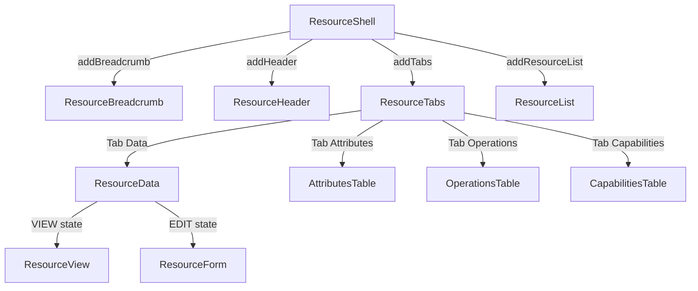

# Composable Resource Components

## Goal

Build a set of composable, reusable UI components in `org.jboss.hal.ui.resource` for viewing and interacting with WildFly management resources. These components can be composed together or used individually, independent of the model browser.

The model browser (`org.jboss.hal.ui.modelbrowser`) continues working as-is. Once the new components are solid, the model browser migrates to consume them in a follow-up — eliminating temporary duplication.

## Components

| Component | Responsibility | Package |
|---|---|---|
| **ResourceShell** | Layout shell: accepts breadcrumb, header, and content (tabs or resource list) | `ui.resource` |
| **ResourceBreadcrumb** | Clickable address segments for a resource | `ui.resource` |
| **ResourceHeader** | Name + stability label + description | `ui.resource` |
| **ResourceTabs** | Tab container (Data, Attributes, Operations, Capabilities) | `ui.resource` |
| **ResourceList** | Filterable list of child resources with add/remove/view actions | `ui.resource` |
| **ResourceData** | View/edit state machine for resource attributes (renamed from ResourceManager) | `ui.resource.data` |

Existing components used as-is inside the new components:

| Component | Role | Package |
|---|---|---|
| **ResourceView** | Read-only presentation of attribute values | `ui.resource.view` |
| **ResourceForm** | Editable form with validation and DMR operation generation | `ui.resource.form` |
| **AttributesTable** | Read-only metadata table of attribute descriptions | `ui.modelbrowser` (consumed, not moved) |
| **OperationsTable** | Filterable operations table with execute buttons | `ui.modelbrowser` (consumed, not moved) |
| **CapabilitiesTable** | Capabilities table | `ui.modelbrowser` (consumed, not moved) |

## Component Hierarchy



## Layering

```
ResourceShell (layout — composable container)
  ├─ ResourceBreadcrumb (navigation — clickable address segments)
  ├─ ResourceHeader (presentation — name + stability + description)
  ├─ ResourceTabs (composition — which perspectives to show)
  │    ├─ Tab "Data" → ResourceData (behavior — view/edit state machine)
  │    │    ├─ ResourceView (presentation — read-only)
  │    │    └─ ResourceForm (presentation — editable)
  │    ├─ Tab "Attributes" → AttributesTable (presentation — metadata table)
  │    ├─ Tab "Operations" → OperationsTable (presentation — operations + execute)
  │    └─ Tab "Capabilities" → CapabilitiesTable (presentation — capabilities list)
  └─ ResourceList (alternative to tabs, for folder nodes)
```

## Composition API

All components receive `AddressTemplate` + `Metadata` at construction time. Factory methods follow the existing HAL pattern (`componentName(args)`).

### Resource node (full view)

```java
resourceShell(template, metadata)
    .addBreadcrumb(resourceBreadcrumb(template, metadata))
    .addHeader(resourceHeader(template, metadata))
    .addTabs(resourceTabs(template, metadata))
```

### Folder node (child list)

```java
resourceShell(template, metadata)
    .addBreadcrumb(resourceBreadcrumb(template, metadata))
    .addHeader(resourceHeader(template, metadata))
    .addResourceList(resourceList(template, metadata))
```

### Minimal (tabs only, embedded in a config page)

```java
resourceShell(template, metadata)
    .addTabs(resourceTabs(template, metadata))
```

### Standalone editor (no shell)

```java
resourceData(template, metadata)
```

## Constructor Contract

All components accept `(AddressTemplate template, Metadata metadata)`:

- **template** — identifies the management resource
- **metadata** — the schema (resource description + security context), pre-fetched by the caller via `MetadataRepository.lookup()`

Components never fetch metadata themselves. The caller performs the single async lookup, then constructs the component tree synchronously.

## Data Loading Pattern

Components that need runtime data (attribute values, child resource names) follow the Elemento `Attachable` pattern:

| Phase | What happens |
|---|---|
| **Construction** | Receives `template` + `metadata`. Builds DOM skeleton synchronously. No network calls. |
| **Attach** | Fetches runtime data via `Dispatcher`. Populates the skeleton. |
| **Refresh** | Re-executes the attach load. |

This pattern applies to:

- **ResourceData** — on attach: `dispatcher.execute(READ_RESOURCE)` → populates ResourceView or ResourceForm
- **ResourceList** — on attach: `dispatcher.execute(READ_CHILDREN_NAMES)` → populates DataList

All other components (ResourceShell, ResourceBreadcrumb, ResourceHeader, ResourceTabs) render fully from metadata at construction time — no attach-time data loading needed.

## Communication

New components use **callbacks** instead of model-browser-specific DOM events:

```java
resourceList(template, metadata)
    .onSelect((template) -> { /* navigate to resource */ })
    .onAdd((parentTemplate, childName, singleton) -> { /* open add dialog */ })
    .onDelete((template) -> { /* open delete dialog */ })
```

When the model browser migrates to use these components, it wires callbacks to its existing `ModelBrowserEvents` system. Other consumers wire callbacks however they like.

## Package Structure

```
ui/resource/
  ├─ ResourceBreadcrumb.java       (new)
  ├─ ResourceHeader.java           (new)
  ├─ ResourceList.java             (new)
  ├─ ResourceShell.java            (new)
  ├─ ResourceTabs.java             (new)
  ├─ data/                         (renamed from manager/)
  │    ├─ ResourceData.java        (renamed from ResourceManager)
  │    ├─ ResourceDataToolbar.java  (renamed from ResourceToolbar)
  │    └─ ResourceFilter.java
  ├─ view/                         (unchanged)
  │    ├─ ResourceView.java
  │    ├─ ViewItem.java
  │    ├─ ViewItemFactory.java
  │    ├─ ViewItemProvider.java
  │    ├─ ViewItemProviders.java
  │    └─ CapabilityReference.java
  ├─ form/                         (unchanged)
  │    ├─ ResourceForm.java
  │    ├─ FormItem.java
  │    ├─ FormItemFactory.java
  │    └─ ... (other form items)
  └─ dialog/                       (unchanged)
       ├─ ResourceDialogs.java
       └─ ExecuteOperationDialog.java
```

## What Stays Unchanged

- **Model browser** (`ui.modelbrowser/`) — keeps working as-is, migrates later
- **ResourceView** — read-only presentation widget
- **ResourceForm** — editable form widget
- **AttributesTable, OperationsTable, CapabilitiesTable** — stay in `modelbrowser` package, consumed by `ResourceTabs`
- **ResourceDialogs** — static factory for modal dialogs

## Documentation Deliverables

1. **Architecture doc** (`docs/modelbrowser-architecture.md`) — Mermaid diagrams showing both the current model browser composition and the new composable resource component hierarchy, with component catalog and data flow documentation
2. **Javadoc** — class-level Javadoc on all new and renamed components describing role, composition, and usage
3. **Package-level Javadoc** — `package-info.java` for each package describing its purpose and role in the layering:
   - `ui.resource` — composable resource components (shell, breadcrumb, header, tabs, list)
   - `ui.resource.data` — view/edit state machine for resource attribute values
   - `ui.resource.view` — read-only presentation of resource attributes (existing, update if needed)
   - `ui.resource.form` — editable form for resource attributes (existing, update if needed)
   - `ui.resource.dialog` — modal dialogs for resource operations (existing, update if needed)
