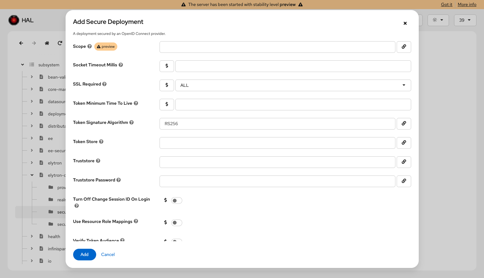
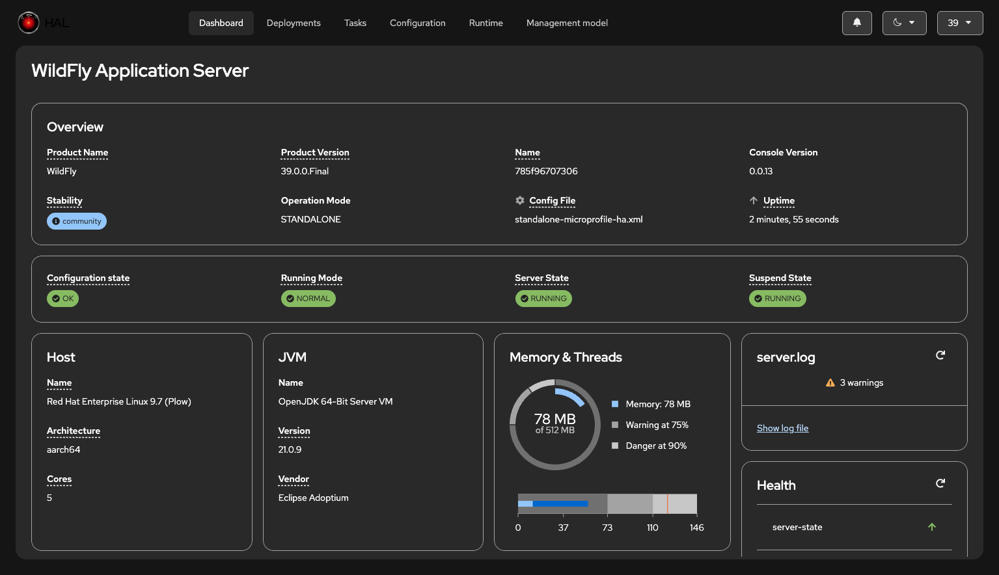
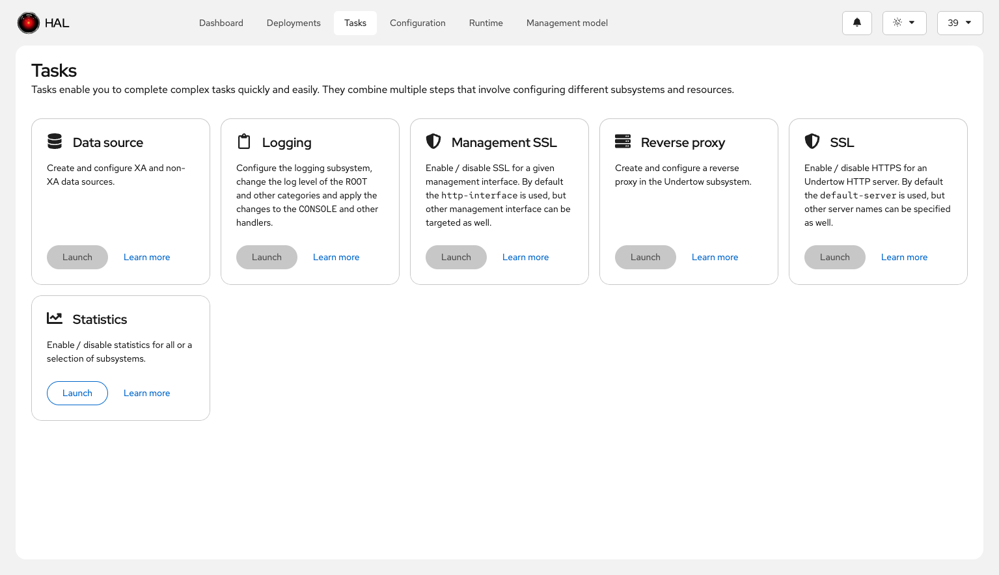

# New features

This document highlights some of the new features of the management console.

## Header

- Notification badge / drawer
- Theme, contrast selector
- Endpoint selector

## Stability level

- Highlight of stability levels for resources, attributes, operations and parameters.

## Dashboard

Here's the dashboard using the dark theme:

## Tasks

The idea behind this new top level category is to provide use case-centric tasks to complete complex management tasks quickly.
They typically combine multiple steps and operations that involves configuring different subsystems and resources.

## Model browser

The model browser has been greatly improved:

- Resizable tree view
- History of selected resources and buttons to go backwards and forwards
- Search the management model for resource addresses, types and names
- Go to arbitrary resources by specifying the resource address
- Clickable breadcrumbs that reflect the currently selected resource address
- Copy the current address to the clipboard
- Descriptions in resources list views
- Follow capability references

### Create dependent resources on the fly

https://github.com/user-attachments/assets/ebfa910b-b52f-4e9d-9e71-689341a16dc2

### Data

- Filter by name, status (defined/undefined, required/not required, deprecated/not deprecated) and mode (storage/access type)
- Attribute description as popovers
- Links for referenced capabilities (popup for multiple references)
- Support for simple nested attributes
- Support for complex attributes in a read-only view
- Info of allowed values
- Syntax highlighting for expressions

### Attributes

- Filter by name, type, status (required/not required, deprecated/not deprecated) and mode (storage/access type)
- Support for nested attributes

### Operations

- Filter by name, signature (parameters/no parameters, return value/no return value) and status (deprecated/not deprecated)
- Omit/show global operations (remembered as a user setting)
- Execute operations

### Capabilities

- New tab that shows the capabilities of the selected resource

## JavaScript API

Some classes expose a JavaScript API. You have to call the methods using the fully qualified name.

### Metadata

- `org.jboss.hal.meta.MetadataRepository.get(String address)` return the metadata as JSON
- `org.jboss.hal.meta.MetadataRepository.lookup(address)` lookup the metadata as JSON and return a promise
- `org.jboss.hal.meta.MetadataRepository.dump()` dump internal data of the metadata repository

### Logging

See https://hal-console.gitbook.io/elemento/logger#controlling-log-levels-from-javascript

## Additional resources

- Demo of the next-gen management console at the WildFly Community Call on 12/2025: https://youtu.be/X43dkm1Zdm4?si=05iSFy7PiekrVK1Z
- Slides of the WildFly Community Call: [wildfly-community-call.pdf](wildfly-community-call.pdf)
